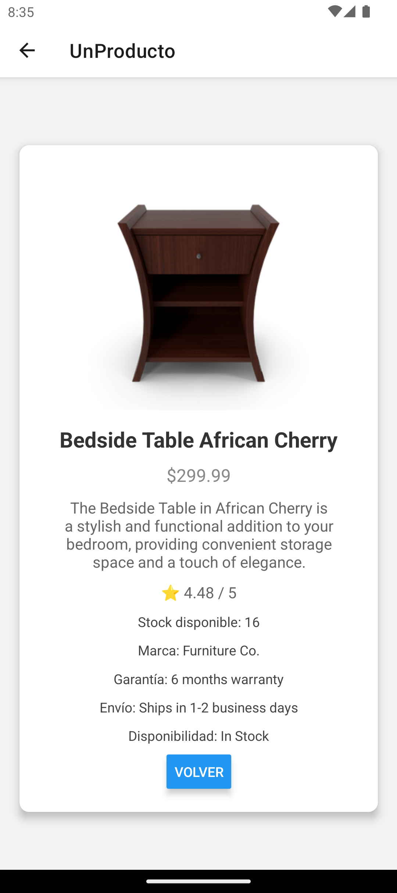
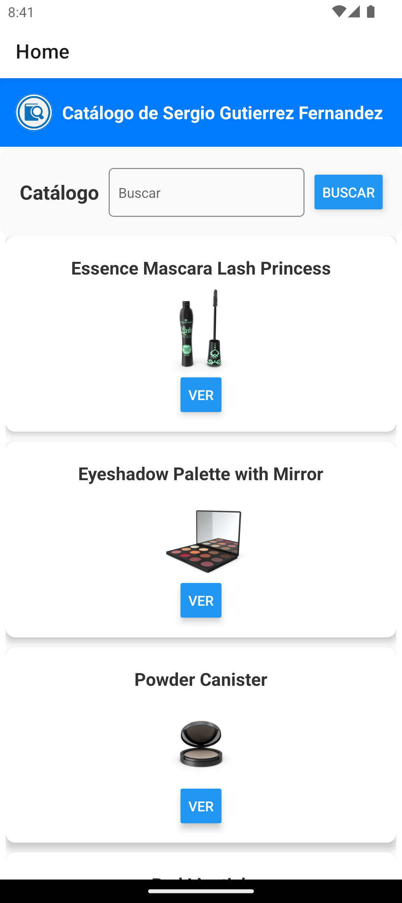

# 📱 P3_RN_productos

> **ES**: Proyecto desarrollado en la asignatura de **Ingeniería Web** en 4º curso de **GITST** (Grado en Ingeniería de Tecnologías y Servicios de Telecomunicación) en la **ETSIT**.  
> **EN**: Project developed for the **Web Engineering** course in the 4th year of **GITST** (Degree in Engineering of Telecommunication Technologies and Services) at **ETSIT**.

---

## 📌 Descripción | Description

🟢 **ES:**  
_P3_RN_productos_ es una aplicación móvil para la gestión y visualización de productos, desarrollada con **React Native** y **Expo**. Permite a los usuarios explorar un catálogo de productos, filtrar por categorías y ver detalles individuales de cada artículo. Utiliza la API pública **DummyJSON** para obtener los datos.  

🔵 **EN:**  
_P3_RN_productos_ is a mobile application for managing and viewing products, developed with **React Native** and **Expo**. It allows users to browse a product catalog, filter by categories, and view detailed information about each item. The app uses the **DummyJSON** public API to fetch data.

---

## 📸 Capturas de pantalla | Screenshots

🟢 **ES:** Aquí tienes una vista previa de la aplicación en acción.  
🔵 **EN:** Here’s a preview of the application in action.  

### 📋 Vista del catálogo de productos | Product catalog view  

<div align="center">
    
</div>

_🛒 Interfaz de listado de productos con opciones de filtrado._  
_🔍 Product listing interface with filtering options._

### 📄 Vista de detalles del producto | Product detail view  

<div align="center">
    
</div>

_📌 Información detallada de un producto seleccionado._  
_📝 Detailed information about a selected product._

---

## 🚀 Características | Features

✅ **ES:**  
✔️ Aplicación nativa para **Android e iOS** con **React Native** y **Expo**.  
✔️ Exploración de un catálogo de productos con múltiples categorías.  
✔️ Filtros avanzados para facilitar la búsqueda de productos.  
✔️ Página de detalles con información específica de cada artículo.  
✔️ Diseño responsive y fácil de usar.  
✔️ Conexión con la API pública [DummyJSON](https://dummyjson.com/).  

✅ **EN:**  
✔️ Native application for **Android and iOS** with **React Native** and **Expo**.  
✔️ Browse a product catalog with multiple categories.  
✔️ Advanced filters to refine product searches.  
✔️ Product detail page with specific information.  
✔️ Responsive and user-friendly design.  
✔️ Uses the public API [DummyJSON](https://dummyjson.com/).  

---

## 🛠️ Tecnologías | Technologies Used

- ⚛ **[React Native](https://reactnative.dev/)** → Desarrollo de aplicaciones móviles con JavaScript.  
- 📲 **[Expo](https://expo.dev/)** → Framework para desarrollar y probar aplicaciones móviles fácilmente.  
- 📄 **AsyncStorage** → Para almacenamiento local de datos en el dispositivo.  
- 🎨 **CSS (Styled Components)** → Estilización responsiva y moderna.  
- 🌍 **[DummyJSON API](https://dummyjson.com/)** → API de productos de prueba.  
- 📡 **Fetch API** → Para realizar peticiones HTTP a DummyJSON.  

---

## 📦 Instalación | Installation

🟢 **ES:**  
Sigue estos pasos para instalar y ejecutar el proyecto:

```bash
git clone https://github.com/tuusuario/P3_RN_productos.git
cd P3_RN_productos
yarn install
```
⚠ **IMPORTANTE**: Usar 'yarn' en lugar de 'npm' para instalar dependencias.


Para ejecutar la aplicación en un dispositivo físico o emulador:
```bash
npx expo start
```

🔵 **EN:**  
Follow these steps to install and run the project:

```bash
git clone https://github.com/tuusuario/P3_RN_productos.git
cd P3_RN_productos
yarn install
```
⚠ **IMPORTANT**: Use 'yarn' instead of 'npm' to install dependencies.

---

## 📂 Estructura del Proyecto | Project Structure

```
P3_RN_productos/
├── assets/        # Imágenes y recursos gráficos
├── components/    # Componentes reutilizables
├── autocorector/  # Scripts del autocorector y tests
├── misc/          # Capturas de pantalla y otros archivos de evidencias
├── App.js         # Componente principal de React Native
├── package.json   # Dependencias del proyecto
├── README.md      # Documentación
```

---

## 📬 Contacto | Contact

📩 **serguccierrez** → [GitHub Profile](https://github.com/serguccierrez)  
Si tienes preguntas o sugerencias, crea un **issue** en este repositorio.  

If you have any questions or suggestions, feel free to open an **issue** in this repository.  

---

💡 _Made with ❤️ by **Serguccierrez**._